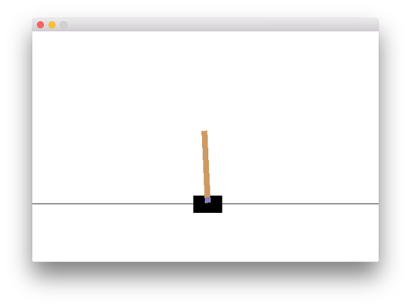

# 準備

## セットアップ

このハンズオンはPython 3を利用する想定で進めます。

### Pythonのインストール

まだ、インストールしていない場合は、[pyenv](https://github.com/yyuu/pyenv)等でPython 3をインストールしてください。

    $ git clone https://github.com/yyuu/pyenv.git ~/.pyenv
    $ echo 'export PYENV_ROOT="$HOME/.pyenv"' >> ~/.bash_profile
    $ echo 'export PATH="$PYENV_ROOT/bin:$PATH"' >> ~/.bash_profile
    $ echo 'eval "$(pyenv init -)"' >> ~/.bash_profile
    $ exec $SHELL
    $ pyenv install 3.5.2
    $ pyenv global 3.5.2
    $ python --version
    Python 3.5.2  # 期待通りのバージョンがインストールされていることを確認してください

UbuntuやFedoraの場合は、~/.bash\_profileでなく、~/.bashrcを指定してください。
macOSの場合は、brew install pyenvで入れることも可能です。
詳しいことは、pyenvのサイトを確認してください。

### OpenAI Gymのインストール

必要なライブラリをインストールします。
macOSの場合:

    $ brew install cmake boost boost-python sdl2 swig wget

Ubuntu 14.04の場合:

    $ apt-get install -y python-numpy python-dev cmake zlib1g-dev libjpeg-dev xvfb libav-tools xorg-dev python-opengl libboost-all-dev libsdl2-dev swig

上記のインストール後、gymをpipでインストールします。

    $ pip install gym[all]

### Gym Starter Kitのインストール

pipでインストールします。

    $ pip install gym-starter-kit

## 動作確認

gym-startコマンドを実行します。

    $ gym-start

以下のようなウィンドウが表示されれば、問題ありません。

